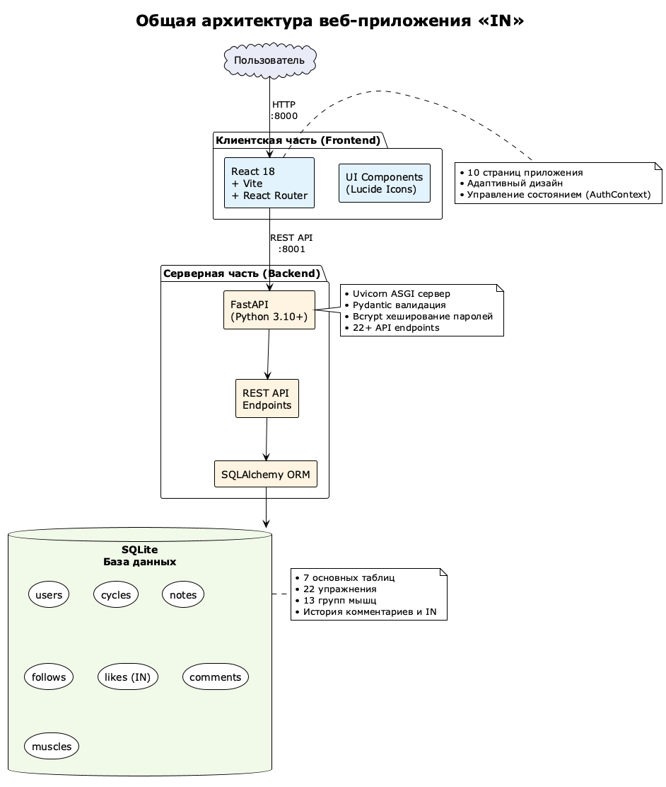
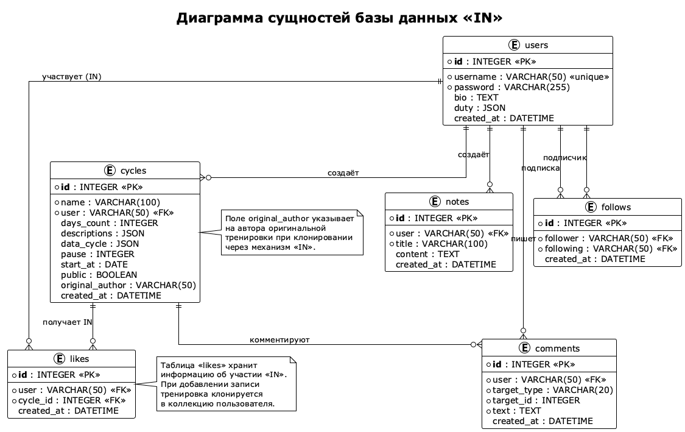
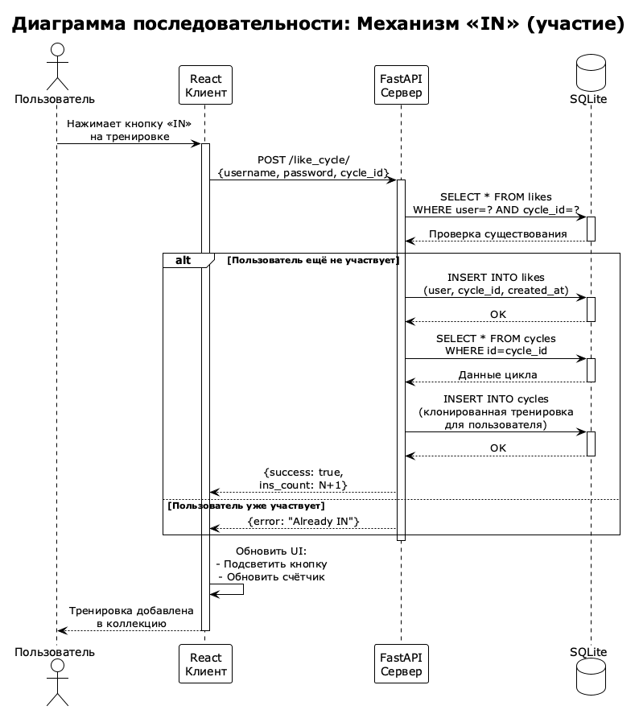

# 💪 IN — веб-приложение для планирования и анализа тренировок

Полнофункциональное веб-приложение для планирования циклических тренировочных программ, ежедневного трекинга выполнения заданий, аналитики мышечной нагрузки по 13 группам мышц и обмена тренировками с друзьями в формате социальной сети. Современный интерфейс с фиксированной панелью навигации, карточками контента, подписками, лентой и уникальной кнопкой **«IN»** — лайк, который одновременно клонирует тренировку в вашу коллекцию.

> **Проектная работа** для открытой городской научно-практической конференции «Инженеры будущего»  
> **Автор:** Гаврилов Тимофей, ученик 10Б класса, ГБОУ Школа № 924  
> **Руководитель:** Дарсавелидзе Александр Александрович, учитель информатики  

---

## 📌 О проекте

Регулярные занятия спортом — важная составляющая здоровья и когнитивного развития школьников. Однако большинство существующих приложений-трекеров (Strong, Hevy, FitNotes) ориентированы на взрослую аудиторию: они сложны в освоении, перегружены функциями и не содержат элементов социального взаимодействия, способных мотивировать подростков.

Данный проект решает эту проблему: **IN** — простое и понятное веб-приложение, в котором можно за минуту собрать тренировочную программу из каталога упражнений, каждый день видеть задания в календаре, получать автоматический анализ нагрузки по группам мышц и делиться тренировками с друзьями. Система сама рассчитывает, какие мышцы перегружены, а какие недотренированы, и выдаёт рекомендации.

### Ключевые особенности

- 🏋️ **Конструктор циклических тренировок** — многодневные программы с упражнениями, подходами и днями отдыха
- 📊 **Аналитика мышечной нагрузки** — автоматический расчёт недельной нагрузки по 13 группам мышц с коэффициентами вовлечённости
- 📅 **Ежедневный трекер** — календарь с тепловой картой интенсивности и чекбоксами заданий
- 🔥 **Кнопка «IN»** — уникальный лайк, который автоматически клонирует тренировку в вашу коллекцию
- 👥 **Социальная сеть** — подписки, лента, поиск, комментарии, профили пользователей
- 📝 **Заметки** — личные записи для отслеживания прогресса
- 🎯 **22 упражнения** — каталог с научно обоснованными коэффициентами нагрузки

---

## 🏗️ Структура проекта

```
regime-maker/
├── API/                          # Серверная часть (Python)
│   ├── web.py                    #   Основной сервер FastAPI (30+ эндпоинтов)
│   ├── auth.py                   #   Аутентификация (passlib + bcrypt)
│   ├── schemas.py                #   Pydantic-схемы валидации (22 схемы)
│   ├── requirements.txt          #   Зависимости Python
│   ├── data/                     #   Модели SQLAlchemy
│   │   ├── db_session.py         #     Инициализация БД и миграции
│   │   ├── users.py              #     Пользователи (duty JSON, bio)
│   │   ├── cycles.py             #     Тренировочные циклы
│   │   ├── notes.py              #     Текстовые заметки
│   │   ├── follows.py            #     Подписки (follower ↔ following)
│   │   ├── likes.py              #     Лайки «IN» (user ↔ cycle_id)
│   │   ├── comments.py           #     Комментарии (полиморфные)
│   │   └── muscles.py            #     13 групп мышц + оптимальные объёмы
│   ├── db/
│   │   └── exercises.json        #   Каталог 22 упражнений с коэффициентами
│   └── tests/                    #   Автоматизированные тесты (11 файлов)
│
├── WEB/                          # Клиентское приложение (React)
│   ├── src/
│   │   ├── App.jsx               #     Маршрутизация (React Router v6)
│   │   ├── api.js                #     HTTP-клиент с дедупликацией запросов
│   │   ├── context/
│   │   │   └── AuthContext.jsx   #     Контекст авторизации (localStorage)
│   │   ├── pages/                #     10 страниц приложения
│   │   │   ├── Feed.jsx          #       Лента подписок
│   │   │   ├── Explore.jsx       #       Поиск тренировок и пользователей
│   │   │   ├── Create.jsx        #       Конструктор циклов и заметок
│   │   │   ├── Day.jsx           #       Ежедневный трекер + тепловая карта
│   │   │   ├── Workouts.jsx      #       Все тренировки пользователя
│   │   │   ├── Profile.jsx       #       Профиль (статистика, вкладки)
│   │   │   ├── Analytics.jsx     #       Аналитика мышечной нагрузки
│   │   │   ├── UserProfile.jsx   #       Профиль другого пользователя
│   │   │   ├── Login.jsx         #       Вход в систему
│   │   │   └── Register.jsx      #       Регистрация
│   │   └── components/           #     Переиспользуемые UI-компоненты
│   │       ├── Layout.jsx        #       Шапка + нижняя навигация
│   │       ├── WorkoutCard.jsx   #       Карточка тренировки + IN
│   │       ├── CommentSection.jsx#       Секция комментариев
│   │       └── ui/               #       Базовые компоненты (shadcn-стиль)
│   ├── vite.config.js            #   Конфигурация Vite + прокси /api → :8001
│   └── package.json              #   Зависимости фронтенда
│
├── start.sh                      # Скрипт запуска обоих сервисов
├── generate_report.py            # Генерация отчёта .docx
└── README.md
```

---

## 🚀 Установка и запуск

### Быстрый старт (один скрипт)

```bash
# Клонирование репозитория
git clone https://github.com/darsavelidze/regime-maker.git
cd regime-maker
```

```bash
# Создание виртуального окружения
python3 -m venv venv
source venv/bin/activate        # macOS / Linux
# venv\Scripts\activate         # Windows
```

```bash
# Установка зависимостей
pip install -r API/requirements.txt
cd WEB && npm install && cd ..
```

```bash
# Запуск
./start.sh
```

### Ручной запуск (два терминала)

```bash
# Терминал 1 — API-сервер
cd API && python3 web.py
```

```bash
# Терминал 2 — Vite dev-сервер
cd WEB && npx vite --port 8000
```

**Адреса:**

| Сервис    | URL                          |
|-----------|------------------------------|
| Веб-приложение | `http://127.0.0.1:8000` |
| API-сервер     | `http://127.0.0.1:8001` |

---

## 🎮 Как пользоваться

1. **Зарегистрируйтесь** — введите имя пользователя и пароль
2. **Создайте тренировку** — перейдите на вкладку «➕ Создать», выберите упражнения из каталога, укажите количество подходов и дней
3. **Тренируйтесь** — на вкладке «📅 День» видьте задания на сегодня и отмечайте выполненные
4. **Анализируйте** — откройте аналитику любой тренировки, чтобы увидеть распределение нагрузки по мышцам
5. **Делитесь** — опубликуйте тренировку и поделитесь с друзьями
6. **Подписывайтесь** — находите интересных пользователей, подписывайтесь и смотрите их тренировки в ленте
7. **Нажмите «IN»** — если понравилась чужая тренировка, нажмите «IN» и она автоматически появится в вашей коллекции

### Страницы приложения

| Страница | Описание |
|----------|----------|
| 🏠 Лента | Тренировки пользователей, на которых вы подписаны |
| 🔍 Поиск | Поиск тренировок и пользователей по ключевым словам |
| ➕ Создать | Конструктор тренировочных циклов и заметок |
| 📅 День | Ежедневный трекер с календарём и тепловой картой |
| 💪 Тренировки | Полный список ваших тренировочных циклов |
| 👤 Профиль | Статистика, подписчики, тренировки, заметки |

---

## 🔧 Как это работает

### Система тренировочных циклов

```
Создание цикла: название + N тренировочных дней + M дней отдыха + дата начала
       ↓
Для каждого дня: выбор упражнений из каталога + количество подходов
       ↓
Автоматическое определение дня цикла:
  день_в_цикле = (сегодня − дата_начала) mod (N + M)
       ↓
Если день_в_цикле < N → тренировочный день (показать задания)
Если день_в_цикле ≥ N → день отдыха
```

### Аналитика мышечной нагрузки

```
Для каждого упражнения → коэффициенты вовлечённости мышц (0.0–0.9)
       ↓
Недельная нагрузка = Σ(подходы × коэффициент) × 7 / (тренировочные дни + пауза)
       ↓
Сравнение с оптимальным объёмом → 5 уровней оценки:
  🔴 Перегрузка (>130%)  │  🟢 Оптимально (80–130%)
  🟠 Умеренно (40–80%)   │  🟡 Недостаточно (10–40%)
  ⚪ Не тренируется (<10%)
```

### Архитектура



**Общая схема:**
- **Клиент** (React + Vite) на порту 8000
- **Сервер** (FastAPI) на порту 8001  
- **База данных** SQLite с 6 таблицами
- Взаимодействие через REST API

### Диаграмма сущностей (ER-диаграмма)



**Структура базы данных:**
- `users` — пользователи с bio и duty (JSON ежедневных заданий)
- `cycles` — тренировочные циклы с data_cycle (JSON упражнений)
- `notes` — текстовые заметки
- `follows` — подписки между пользователями
- `likes` — участие «IN» (связь user ↔ cycle_id)
- `comments` — комментарии к тренировкам и заметкам

### Механизм «IN» — диаграмма последовательности



**Процесс участия:**
1. Пользователь нажимает кнопку «IN» на тренировке
2. Клиент отправляет POST /like_cycle/ с credentials
3. Сервер проверяет наличие записи в таблице likes
4. Если пользователь ещё не участвует:
   - Добавляется запись в likes
   - Тренировка клонируется в коллекцию пользователя
   - Сохраняется original_author
5. Клиент обновляет UI (подсвечивает кнопку, обновляет счётчик)

### Ключевые модули

- **API/web.py** — основной сервер: 30+ эндпоинтов для CRUD тренировок, аналитики, социальных функций, ежедневного трекера
- **API/auth.py** — хеширование паролей bcrypt, верификация учётных данных
- **API/schemas.py** — 22 Pydantic-схемы валидации входных данных
- **API/data/muscles.py** — 13 групп мышц с оптимальными недельными объёмами и временем восстановления
- **WEB/src/api.js** — HTTP-клиент с дедупликацией одновременных GET-запросов
- **WEB/src/components/WorkoutCard.jsx** — карточка тренировки с кнопкой «IN», всплывающими подсказками и комментариями

---

## ⚙️ Стек технологий

| Категория | Технология | Назначение |
|-----------|-----------|------------|
| Серверный язык | Python 3.10+ | Бизнес-логика, API |
| Веб-фреймворк | FastAPI | Асинхронный REST API с автодокументацией |
| ORM | SQLAlchemy | Объектно-реляционное отображение |
| База данных | SQLite | Встраиваемая СУБД без сервера |
| Валидация | Pydantic v2 | Типизированные схемы запросов |
| Безопасность | passlib + bcrypt | Хеширование паролей |
| Фронтенд | React 18 | Компонентный пользовательский интерфейс |
| Маршрутизация | React Router v6 | SPA-навигация |
| Сборщик | Vite | HMR, прокси, быстрая сборка |
| Иконки | Lucide React | SVG-иконки для интерфейса |

---

## 📋 API-эндпоинты

### Аутентификация и профиль

| Метод | Эндпоинт | Описание |
|-------|----------|----------|
| POST | `/sign_up/` | Регистрация нового пользователя |
| POST | `/sign_in/` | Авторизация (проверка пароля) |
| GET | `/profile/{username}/` | Публичный профиль пользователя |
| POST | `/update_profile/` | Обновление описания профиля (bio) |

### Тренировочные циклы

| Метод | Эндпоинт | Описание |
|-------|----------|----------|
| POST | `/create_cycle/` | Создать тренировочный цикл |
| POST | `/user_cycles/` | Получить все циклы пользователя |
| POST | `/delete_cycle/` | Удалить тренировочный цикл |
| POST | `/publish_cycle/` | Опубликовать тренировку |
| POST | `/unpublish_cycle/` | Снять с публикации |

### Ежедневный трекер

| Метод | Эндпоинт | Описание |
|-------|----------|----------|
| POST | `/get_day/` | Получить задания на указанную дату |
| POST | `/toggle_duty/` | Переключить статус выполнения задания |
| POST | `/get_month_duties/` | Тепловая карта интенсивности за месяц |

### Аналитика

| Метод | Эндпоинт | Описание |
|-------|----------|----------|
| POST | `/analyze_cycle/` | Анализ мышечной нагрузки цикла |
| POST | `/analyze_all_cycles/` | Суммарный анализ всех циклов |
| GET | `/get_exercises/` | Каталог упражнений |

### Социальные функции

| Метод | Эндпоинт | Описание |
|-------|----------|----------|
| POST | `/follow/` | Подписаться на пользователя |
| POST | `/unfollow/` | Отписаться |
| GET | `/followers/{username}/` | Список подписчиков |
| GET | `/following/{username}/` | Список подписок |
| POST | `/like_cycle/` | Поставить «IN» (лайк + клонирование) |
| POST | `/unlike_cycle/` | Убрать «IN» |
| POST | `/feed/` | Лента подписок |
| POST | `/search/` | Поиск тренировок и пользователей |

### Комментарии

| Метод | Эндпоинт | Описание |
|-------|----------|----------|
| POST | `/add_comment/` | Добавить комментарий |
| POST | `/get_comments/` | Получить комментарии |
| POST | `/delete_comment/` | Удалить комментарий |

---

## 🔮 Планы развития

- Переход на JWT-токены для безопасной аутентификации
- Push-уведомления о новых подписках, «IN» и комментариях
- Графики прогресса (динамика выполнения по неделям и месяцам)
- Видеоинструкции по технике выполнения упражнений
- Пользовательские упражнения с настраиваемыми коэффициентами
- Переход на PostgreSQL для масштабирования
- Мобильное приложение на React Native
- Контейнеризация с Docker

---

## ⚠️ Важно

Проект предназначен **для образовательных и демонстрационных целей**. Он разработан как учебный проект в рамках научно-практической конференции и может быть использован как основа для дальнейших исследований в области спортивных приложений и веб-разработки.

---

## 📄 Лицензия

Учебный проект — ГБОУ Школа № 924, Москва, 2025–2026.